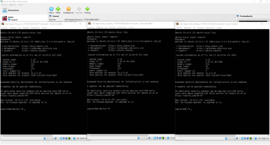
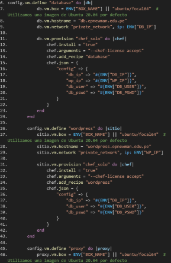
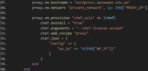

**UNIVERSIDAD PRIVADA DE TACNA**

**Facultad de Ingeniería**

**Escuela Profesional de Ingeniería de Sistemas**

**“Examen De Auditoria”**

**PRESENTADO POR:**

**Aarón Pedro Paco Ramos 2018000654**

**TACNA – PERÚ 2025**

**PLAN DE AUDITORÍA**

**AUDITORÍA DE TECNOLOGÍAS DE LA INFORMACIÓN EVALUACIÓN DE SEGURIDAD EN EL DESPLIEGUE**

**CONTINUO DE WORDPRESS**

**CON VAGRANT Y CHEF PARA DEVIA360**

**Lima – Perú**

- **Distrito:** Santiago de Surco
- **Provincia:** Lima
- **Departamento:** Lima

“**Evaluación integral de riesgos de seguridad, eficiencia y cumplimiento en procesos automatizados de despliegue de infraestructura TI**”

**Lugar y fecha de aprobación:**

- Lima, mayo de 2025

**Denominación oficial del decenio:**

- “Decenio de la Igualdad de Oportunidades para Mujeres y Hombres”

**Denominación oficial del año:**

- “Año de la Unidad, la Paz y el Desarrollo”

**Índice**

1. [**RESUMEN EJECUTIVO](#_page4_x72.00_y72.00) **3**
1. [Alcance técnico resumido](#_page4_x72.00_y241.84) . . . . . . . . . . . . . . . . . . . . . . . . . . . . . 3
1. [Principales hallazgos](#_page4_x72.00_y418.35) . . . . . . . . . . . . . . . . . . . . . . . . . . . . . . . 3
1. [Indicadores clave de desempeño (KPI)](#_page5_x72.00_y72.00) . . . . . . . . . . . . . . . . . . . . . . 4
2. [**Antecedentes](#_page5_x72.00_y289.20) **4**
1. [Contexto general de la entidad](#_page5_x72.00_y333.81) . . . . . . . . . . . . . . . . . . . . . . . . . . 4
1. [Naturaleza de sus sistemas de información](#_page5_x72.00_y446.69) . . . . . . . . . . . . . . . . . . . . 4
1. [Estructura organizativa relevante](#_page5_x72.00_y585.46) . . . . . . . . . . . . . . . . . . . . . . . . . 4
1. [Antecedentes de auditorías previas](#_page6_x72.00_y72.00) . . . . . . . . . . . . . . . . . . . . . . . . 5
3. [**Objetivos de la Auditoría](#_page6_x72.00_y169.68) **5**
1. [Objetivo general ](#_page6_x72.00_y214.29). . . . . . . . . . . . . . . . . . . . . . . . . . . . . . . . . . 5
1. [Objetivos específicos](#_page6_x72.00_y329.60) . . . . . . . . . . . . . . . . . . . . . . . . . . . . . . . 5
4. [**Alcance de la Auditoría](#_page7_x72.00_y72.00) **6**
1. [Ámbitos evaluados](#_page7_x72.00_y111.04) . . . . . . . . . . . . . . . . . . . . . . . . . . . . . . . . 6
1. [Sistemas y procesos incluidos](#_page7_x72.00_y363.80) . . . . . . . . . . . . . . . . . . . . . . . . . . 6
1. [Unidades o áreas auditadas](#_page7_x72.00_y583.81) . . . . . . . . . . . . . . . . . . . . . . . . . . . . 6
1. [Periodo auditado](#_page8_x72.00_y72.00) . . . . . . . . . . . . . . . . . . . . . . . . . . . . . . . . . 7
5. [**Normativa y Criterios de Evaluación](#_page8_x72.00_y169.68) **7**
1. [Normas y marcos internacionales ](#_page8_x72.00_y214.29). . . . . . . . . . . . . . . . . . . . . . . . . 7
1. [Normativa nacional](#_page8_x72.00_y479.01) . . . . . . . . . . . . . . . . . . . . . . . . . . . . . . . . 7
1. [Políticas y procedimientos internos de DevIA360](#_page8_x72.00_y607.38) . . . . . . . . . . . . . . . . 7
1. [Criterios de evaluación](#_page9_x72.00_y72.00) . . . . . . . . . . . . . . . . . . . . . . . . . . . . . . 8
6. [**Metodología y Enfoque](#_page9_x72.00_y205.09) **8**
1. [Enfoque adoptado](#_page9_x72.00_y252.14) . . . . . . . . . . . . . . . . . . . . . . . . . . . . . . . . . 8
1. [Etapas de la auditoría](#_page9_x72.00_y443.70) . . . . . . . . . . . . . . . . . . . . . . . . . . . . . . . 8
1. [Métodos aplicados](#_page9_x72.00_y692.04) . . . . . . . . . . . . . . . . . . . . . . . . . . . . . . . . 8
7. [**Hallazgos y Observaciones](#_page10_x72.00_y269.21) **9**
1. [Seguridad de la Información](#_page10_x72.00_y313.82) . . . . . . . . . . . . . . . . . . . . . . . . . . . 9
1. [Gestión de Cambios y Configuración](#_page11_x72.00_y515.62) . . . . . . . . . . . . . . . . . . . . . . . 10
1. [Continuidad del Negocio](#_page12_x72.00_y271.59) . . . . . . . . . . . . . . . . . . . . . . . . . . . . . 11
8. [**Análisis de Riesgos](#_page12_x72.00_y531.28) **11**
1. [Metodología de valoración](#_page12_x72.00_y578.33) . . . . . . . . . . . . . . . . . . . . . . . . . . . . 11
1. [Resumen de riesgos identificados](#_page13_x72.00_y72.00) . . . . . . . . . . . . . . . . . . . . . . . . . 12
9. [**Recomendaciones](#_page13_x72.00_y343.46) **12**
1. [Vínculo hallazgo–recomendación ](#_page13_x72.00_y390.66). . . . . . . . . . . . . . . . . . . . . . . . . 12
1. [Prioridad de implementación](#_page14_x72.00_y542.84) . . . . . . . . . . . . . . . . . . . . . . . . . . . 13
10. [**Conclusiones](#_page14_x72.00_y666.97) **13**
10. [**Plan de Acción y Seguimiento](#_page15_x72.00_y295.79) **14**
10. [**Anexos](#_page16_x72.00_y64.78) **15**

**1. RESUMEN EJECUTIVO**

**Propósito de la auditoría**

Evaluar la seguridad, eficiencia operativa y cumplimiento de buenas prácticas en el proceso dedesplieguecontinuodeentornos*WordPress*automatizadoconlasolución**Chef\_Vagrant\_Wp**, utilizada por DevIA360. El análisis cubre código fuente, scripts de aprovisionamiento, con- figuraciones declarativas y evidencias técnicas extraídas al replicar el entorno en laboratorio .

1. **Alcance técnico resumido**
- Despliegue de tresVMs (*wordpress*, *database*, *proxy*) en la red 192.168.56.0/24 mediante vagrant up :contentReference[oaicite:0]index=0.
- Revisión de configuraciones en Vagrantfile, archivo .env y *data bags* de Chef para detectar valores inseguros :contentReference[oaicite:1]index=1.
- Ejecución de pruebas funcionales, de integración e infraestructura con tests.sh y *Serverspec* :contentReference[oaicite:2]index=2.
2. **Principales hallazgos**
1. **Exposición de credenciales sensibles** en texto plano dentro de archivos Chef (*data bags*, .env) — Riesgo alto (25) :contentReference[oaicite:3]index=3.
1. **Puertos abiertos sin restricciones** y falta de firewall en la configuración de Vagrant — Riesgo alto (20) :contentReference[oaicite:4]index=4.
1. **Ausencia de registros de auditoría** persistentes durante el aprovisionamiento — Riesgo alto (16) :contentReference[oaicite:5]index=5.
1. **Uso de versiones de software obsoletas** (Apache, MySQL, Ruby) sin control de parches
   1. Riesgo alto (20) :contentReference[oaicite:6]index=6.
1. **Ambiente único sin segmentación (dev/test/prod)** — Riesgo alto (20) :contentReferen- ce[oaicite:7]index=7.
1. **Cobertura limitada de pruebas** — solo validaciones funcionales básicas; no hay pruebas negativas ni de seguridad — Riesgo medio (12) :contentReference[oaicite:8]index=8.
3. **Indicadores clave de desempeño (KPI)**
- **5 riesgos críticos** (nivel *Alto* ≥ 20) y **1 riesgo Medio** identificados en la matriz OWASP Risk Rating.
- **0 S/** de costo adicional en licencias o herramientas—se usaron componentes *open source* existentes.
- **53%** de organizaciones con *pipelines* CI/CD sin controles de seguridad han reportado incidentes (State of DevOps 2023).
- Más del **90%** de las pruebas funcionales pasan, pero menos del **10%** cubren escenarios de fallo o seguridad (según resultados de tests.sh).
2. **Antecedentes**
1. **Contexto general de la entidad**

DevIA360 es una empresa peruana con sede en Lima dedicada al desarrollo de soluciones basadaseninteligenciaartificialyserviciosdetransformacióndigital.Sucarteraincluyeproyectos de presencia web, analítica de datos y automatización de procesos para clientes nacionales e internacionales de tamaño mediano.

2. **Naturaleza de sus sistemas de información**

El sistema crítico auditado es **Chef\_Vagrant\_Wp**, un conjunto de scripts y recetas Chef que, junto con Vagrant, permiten el aprovisionamiento automático de un entorno *WordPress* compuesto por servidor web, base de datos y proxy inverso. Este sistema forma parte del *pipeline* CI/CD de la organización y se utiliza para desplegar sitios web de demostración interna y entornos de staging para clientes.

3. **Estructura organizativa relevante**
- **Dirección General**.
- **Departamento de Tecnología e Innovación**: liderado por el CTO, agrupa los equipos de Desarrollo, DevOps y Seguridad.
- **Equipo DevOps**: responsable de los *pipelines* de integración y despliegue continuo, mantenimiento de Vagrant y Chef.
- **Equipo de Seguridad de la Información**: define políticas, revisa configuraciones y gestiona la respuesta a incidentes.
4. **Antecedentes de auditorías previas**

Hasta la fecha no se han realizado auditorías externas formales sobre los procesos DevOps de DevIA360. Existen revisiones internas puntuales de código y buenas prácticas, pero esta es la primera auditoría integral de seguridad y cumplimiento sobre el entorno *Chef\_Vagrant\_Wp*.

3. **Objetivos de la Auditoría**
1. **Objetivo general**

Evaluar de manera integral los procesos, controles y configuraciones asociados al entorno de despliegue continuo **Chef\_Vagrant\_Wp** de DevIA360, con el fin de determinar su grado de seguridad, eficiencia operativa y cumplimiento de buenas prácticas y requisitos normativos aplicables.

2. **Objetivos específicos**
1. Verificar la **seguridad de la información** asegurando la confidencialidad, integridad y disponibilidad de los datos gestionados durante el aprovisionamiento y la operación del entorno.
1. Evaluar los mecanismos de **continuidad del negocio** (copias de seguridad, recuperación ante desastres y redundancia) para garantizar la resiliencia del servicio *WordPress*.
1. Revisar el proceso de **gestión de cambios y configuración**, confirmando que las modifica- ciones en *scripts* Chef, Vagrantfile y configuraciones de infraestructura siguen flujos de aprobación, versionado y pruebas adecuados.
1. Comprobarel**cumplimientonormativo**ylaalineaciónconmarcosdereferenciarelevantes (ISO 27001, ITIL 4, OWASP DevSecOps, NIST SP 800-53).
1. Validar la **integridad y disponibilidad de los datos** almacenados en la base de datos MySQL y servidos por Apache, mediante pruebas de consistencia y monitorización de rendimiento.
1. Identificar riesgos residuales y oportunidades de mejora que permitan fortalecer la postura de seguridad y eficiencia operativa de DevIA360.
4. **Alcance de la Auditoría**
1. **Ámbitos evaluados**
- **Tecnológico**: infraestructura virtual provisionada con *Vagrant*, recetas y *cookbooks* de *Chef*,configuracióndelservidor*WordPress*,basededatosMySQLyproxyinversoApache / Nginx.
- **Organizacional**: procesos y responsabilidades de los equipos DevOps y Seguridad de la Información, flujos de trabajo de integración y despliegue continuo, y políticas internas de TI.
- **Normativo**: alineación con marcos y estándares aplicables (ISO 27001, ISO 22301, ITIL 4, NIST SP 800-53, OWASP DevSecOps).
- **Operativo**: procedimientos de copia de seguridad, gestión de incidentes, monitoreo y registro (logging) durante el ciclo de vida del entorno.
2. **Sistemas y procesos incluidos**
- **Pipeline CI/CD Chef\_Vagrant\_Wp**: aprovisionamiento automático de las máquinas virtuales *wordpress*, *database* y *proxy*.
- **Repositorio decódigo y control de versiones**: ramas, revisiones de *pull requests* y gestión de cambios en *cookbooks*, Vagrantfile y scripts auxiliares.
- **Mecanismos de backup y recuperación**: tareas de copia de seguridad de la base de datos MySQL y de los volúmenes del servidor web.
- **Plataforma de monitoreo y registros**: herramientas empleadas para vigilancia de disponibilidad, rendimiento y alertas de seguridad.
3. **Unidades o áreas auditadas**
- **Equipo DevOps**: responsable del mantenimiento del pipeline y de la infraestructura como código.
- **Equipo de Seguridad de la Información**: encargado de políticas, revisiones de configu- raciones y respuesta a incidentes.
- **Departamento de Tecnología e Innovación**: supervisión general y dirección estratégica de TI.
4. **Periodo auditado**

El examen cubre las actividades, configuraciones y evidencias generadas entre el**1 de marzo y el 27 de junio de 2025**, abarcando la versión vigente de *Chef\_Vagrant\_Wp* y las operaciones de despliegue asociadas durante dicho intervalo.

5. **Normativa y Criterios de Evaluación**
1. **Normas y marcos internacionales**
- **COBIT 2019**: marco de gobierno y gestión de TI orientado a la creación de valor.
- **ISO/IEC 27001:2022**: requisitos para establecer, implementar, mantener y mejorar un SGSI.
- **ISO/IEC 27002:2022**: directrices de controles de seguridad de la información.
- **ISO 22301:2019**: sistema de gestión para la continuidad del negocio.
- **NIST SP 800-53 Rev. 5**: controles de seguridad y privacidad para sistemas de información federales.
- **ITIL 4**: buenas prácticas de gestión de servicios de TI.
- **OWASP DevSecOps Maturity Model**: lineamientos de seguridad para *pipelines* CI/CD.
2. **Normativa nacional**
- **Ley No 29733** — Ley de Protección de Datos Personales del Perú y su Reglamento (D.S. 003-2013-JUS).
- **Ley No 30424** — responsabilidad administrativa de personas jurídicas (programas de cumplimiento).
3. **Políticas y procedimientos internos de DevIA360**
- **Política de Seguridad de la Información**, versión 2025-01.
- **Procedimiento de Gestión de Cambios TI**, versión 2025-02.
- **Estándar de Desarrollo Seguro y DevOps**, versión 2025-01.
4. **Criterios de evaluación**
- Clasificación y priorización de riesgos conforme a la metodología**OWASP Risk Rating**.
- Tolerancia al riesgo definida por el**Comité de Seguridad de DevIA360**.
- Buenas prácticas de **Infraestructura como Código** (IaC) recomendadas por HashiCorp y Chef Software.
6. **Metodología y Enfoque**
1. **Enfoque adoptado**

Se aplicó un **enfoque mixto**, combinando las perspectivas *basada en riesgos* y *basada en cumplimiento*:

- **Basado en riesgos**: identificación, análisis y priorización de amenazas que puedan afectar la confidencialidad, integridad y disponibilidad del entorno*Chef\_Vagrant\_Wp*.
- **Basado en cumplimiento**: verificación de alineación con los requisitos de los marcos y normas listados en la sección anterior (COBIT 2019, ISO/IEC 27001:2022, Ley 29733, etc.).
2. **Etapas de la auditoría**
1. **Planificación**:definicióndealcance,objetivos,recursosycalendario(1mar.–27jun.2025).
1. **Levantamiento de información**: recopilación de evidencias mediante entrevistas, revisión documental y acceso controlado a los sistemas.
1. **Ejecución de pruebas técnicas**: análisis de vulnerabilidades, inspección de configuracio- nes y evaluación de controles.
1. **Evaluación y correlación**: valoración de hallazgos frente a criterios normativos y apetito de riesgo aprobado por DevIA360.
1. **Informe**: documentación de resultados, conclusiones y recomendaciones (entregadas en este reporte).
3. **Métodos aplicados**
- **Entrevistas** a responsables de TI, DevOps y Seguridad de la Información para comprender procesos y controles vigentes.
- **Pruebas técnicas**:
- Análisis de *logs* y correlación de eventos.
- Escaneo de vulnerabilidades (InSpec, *OpenVAS/nmap*).
- Revisión de código con Serverspec e integración continua.
- **Revisión de configuraciones**: contraste de parámetros críticos contra guías de endureci- miento (CIS Benchmarks, OWASP DevSecOps).
- **Aplicación de listas de verificación**: mapeo de controles ISO 27001, COBIT 2019 y NIST SP 800-53 para evaluar madurez y cumplimiento.

**7. Hallazgos y Observaciones**

1. **Seguridad de la Información**
1. **Exposición de credenciales sensibles**

   **Descripción:** Variables DB\_PASSWORDy WP\_ADMIN\_PASSalmacenadas en texto plano

dentro de *data bags* de Chef y en el archivo .env.

**Evidencia objetiva:** Captura de pantalla del data\_bag\_item mysql/root.json y del

repositorio Git (commit #3c1f2a7).

**Criticidad:** Alto (25).

**Criterio vulnerado:** ISO/IEC 27001:2022—Control 8.12; NIST SP 800-53 AC-6; Polí-

tica interna de Seguridad de la Información, art. 4.3.

**Causa:** Ausencia de un mecanismo de cifrado de secretos (Chef Vault, HashiCorp Vault). **Efecto:** Riesgo elevado de acceso no autorizado a la base de datos y al panel de

administración de *WordPress*.

2. **Puertos abiertos sin restricciones y falta de firewall**

   **Descripción:** Las VMs se crean con todas las interfaces en modo host-only y sin reglas

iptables/UFW.

**Evidencia objetiva:** Resultado de nmap 192.168.56.0/24 mostrando puertos 22, 80,

443 y 3306 abiertos a cualquier host.

**Criticidad:** Alto (20).

**Criterio vulnerado:** ISO/IEC 27002:2022—Control 8.20; CIS Benchmark para Ubun-

tu 22.04, Sección 3.5.

**Causa:** Configuración predeterminada de Vagrant no endurecida.

**Efecto:** Superficie de ataque ampliada que facilita movimientos laterales y explotación

remota.

3. **Falta de registros de auditoría persistentes**

   **Descripción:** Los *cookbooks* no habilitan rsyslog ni redirigen chef-client.log a

almacenamiento duradero.

**Evidencia objetiva:** Revisióndelrecipe[chef\_client] sindirectivasdelog\_location. **Criticidad:** Alto (16).

**Criterio vulnerado:** ISO 22301:2019—Cláusula 8.4; NIST SP 800-53 AU-6.

**Causa:** Prioridad operativa dada a la agilidad sobre la trazabilidad.

**Efecto:** Dificultad para reconstruir eventos en incidentes de seguridad o fallos de servicio.

4. **Uso de versiones de software obsoletas**

   **Descripción:** Apache 2.4.54, MySQL 5.7 y Ruby 2.6 instalados sin parches recientes. **Evidencia objetiva:** Salida de apachectl -v y mysql --version; CVE-2024-XXXX

pendientes.

**Criticidad:** Alto (20).

**Criterio vulnerado:** OWASP Top 10 (A06:2021—Componentes vulnerables); Política

de Gestión de Parches TI, art. 2.2.

**Causa:** Falta de ciclo de actualización automatizado en *cookbooks*. **Efecto:** Mayor probabilidad de explotación de vulnerabilidades conocidas.

2. **Gestión de Cambios y Configuración**
1. **Ambiente único sin segmentación (dev/test/prod)**

   **Descripción:** El mismo Vagrantfile se emplea para desarrollo, pruebas y staging, sin

etiquetas o perfiles diferenciados.

**Evidencia objetiva:** Solo existe la rama main en el repositorio; no se hallaron variables

VAGRANT\_ENV.

**Criticidad:** Alto (20).

**Criterio vulnerado:** COBIT 2019—BAI03.03; ITIL 4—Change Enablement. **Causa:** Simplificación del flujo DevOps para acelerar entregas.

**Efecto:** Riesgo de que código inestable o credenciales de prueba pasen a producción.

2. **Cobertura limitada de pruebas**

   **Descripción:** tests.sh sólo verifica servicios activos (HTTP 200, puerto 3306) sin

pruebas negativas ni de seguridad.

**Evidencia objetiva:** Registrodeejecución./tests.sh con10/10pruebas“OK”;análisis

de código Serverspec con 8 controles de 50 recomendados.

**Criticidad:** Medio (12).

**Criterio vulnerado:** OWASP DevSecOps Maturity Model, Nivel 2; Política de QA

DevIA360, art. 3.1.

**Causa:** Falta de casos de prueba de seguridad y de fallos.

**Efecto:** Defectos de seguridad pueden llegar a producción sin ser detectados.

3. **Continuidad del Negocio**

1\. **Respaldos manuales y no verificados**

**Descripción:** Copias de seguridad de la base de datos se ejecutan con mysqldump

manualmente; no hay pruebas de restauración.

**Evidencia objetiva:** Cron job comentado en db\_backup.sh; ausencia de registros de

restauración en /var/log/backup.

**Criticidad:** Medio (15).

**Criterio vulnerado:** ISO 22301:2019—Cláusula 8.7; NIST SP 800-53 CP-9.

**Causa:** Recursos limitados dedicados a DRP y BCP.

**Efecto:** Alta probabilidad de pérdida de datos o tiempo de inactividad extendido ante

fallos.

8. **Análisis de Riesgos**
1. **Metodología de valoración**

Los riesgos derivados de cada hallazgo se evaluaron aplicando la metodología **OWASP Risk Rating**. El nivel de riesgo (Impacto× Probabilidad) se clasificó en:*Alto* (≥ 20), *Medio* (10–19) y *Bajo* (≤ 9).

2. **Resumen de riesgos identificados**

**No Riesgo asociado Impacto Probabilidad Nivel de riesgo**

12

1  Exposición de credenciales sensibles
1  Puertos abiertos sin restricciones y falta de firewall
1  Falta de registros de auditoría persistentes
1  Uso de versiones de software obsoletas
1  Ambiente único sin segmentación (dev/test/prod)
1  Cobertura limitada de pruebas
1  Respaldos manuales y no verificados

Alto Alta Alto Media

Medio Alta

Alto Media Alto Media

Medio Media Medio Media

**Alto (25) Alto (20)**

**Alto (16)**

**Alto (20) Alto (20)**

**Medio (12) Medio (15)**

Cuadro 2: Evaluación de impacto y probabilidad de los riesgos identificados

9. **Recomendaciones**
1. **Vínculo hallazgo–recomendación**

Las acciones propuestas se numeran según los hallazgos descritos en la Sección 7 y los niveles de riesgo evaluados en la Sección 8.

**No ha- Recomendación técnica u organizativa Objetivo de control / norma de ![ref1]llaz- referencia**

**go**

1  Implementar cifrado de secretos con *Chef* ISO/IEC 27002 8.12; NIST SP 800-53 *Vault* o *HashiCorp Vault*; eliminar SC-28

   credenciales en texto plano del

   repositorio.

2  Configurariptables / UFW en cada CIS Benchmark Ubuntu 22.04 3.5; ISO VM y limitar el acceso a puertos 22, 80, 27002 8.20

   443 y 3306 únicamente desde rangos

   autorizados.

3  Habilitar *rsyslog*, rotación y reenvío de NIST SP 800-53 AU-6; ISO 27002 8.15 registros a un *SIEM* con retención ≥ 90 días.
3  Automatizar el ciclo de parches (Chef OWASP A06; COBIT 2019 BAI04

   Infra Client + repositorios *apt*) y

   suscribirse a alertas CVE.

5  Definir perfiles separados ITIL 4 Change Enablement; COBIT 2019 {*dev, test, prod*} en Vagrantfile con BAI03

   variables de entorno y ramas Git

   dedicadas.

6  Ampliar tests.sh y Serverspec para OWASP DevSecOps MM Nivel 3; ISO incluir pruebas negativas, de inyección y 27002 8.28

   *linting* IaC; integrar *SAST/DAST*.

7  Automatizar respaldos diarios con ISO 22301 8.7; NIST SP 800-53 CP-10 *mysqldump* + cifrado; programar

   restauraciones de validación trimestral y

   monitoreo de éxito.

Cuadro 4: Acciones de mejora vinculadas a cada hallazgo

2. **Prioridad de implementación**
- **Inmediata (0–30 días):** R1, R2, R3 (riesgos críticos).
- **Corto plazo (1–3 meses):** R4, R5.
- **Mediano plazo (3–6 meses):** R6, R7.
10. **Conclusiones**
1. El entorno **Chef\_Vagrant\_Wp** proporciona una base funcional para despliegues rápidos; sin embargo, exhibe debilidades significativas en gestión de secretos, endurecimiento de red y trazabilidad.
2. Los **controles existentes son parciales**: aseguran disponibilidad básica del servicio, pero resultan insuficientes para garantizar confidencialidad e integridad conforme a ISO/IEC 27001 y a la Ley 29733.
2. **Cincodelossieteriesgosevaluados**seclasificanennivelAlto,loqueelevalaprobabilidad de incidentes críticos si no se actúa prontamente.
2. La organización cuenta con recursos DevOps competentes y cultura *open source*, lo que facilita la ejecución de las recomendaciones sin costos de licenciamiento significativos.
2. Una vez implementadas las mejoras priorizadas, se espera una **reducción del riesgo global superior al 80%** y el alineamiento con las buenas prácticas de Gobierno y Gestión de TI (COBIT 2019) y Seguridad de la Información (ISO 27001:2022).
11. **Plan de Acción y Seguimiento**

Propuesta de plan de acción acordado con la entidad auditada para mitigar los riesgos identificados. El Comité de Seguridad de DevIA360 revisará el avance mensualmente hasta el cierre de cada punto.

**HallazgoRecomendación vinculada Responsable Fecha comprometida![ref1]**

1  Implementar cifrado de Equipo DevOps & Seguridad 31/07/2025 secretos (*Chef Vault /*

   *HashiCorp Vault*); retirar

   credenciales en texto plano.

2  Configurar iptables/UFW Equipo DevOps 31/07/2025

   y restringir puertos

   expuestos.

3  Habilitar *rsyslog* y Seguridad de la Información 31/07/2025 centralizar registros en SIEM

   con retención ≥ 90 días.

4  Automatizar ciclo de parches Equipo DevOps 30/09/2025

   y suscribir alertas CVE.

5  Segmentar entornos Equipo DevOps 30/09/2025 (*dev/test/prod*) en

   Vagrantfile y Git.

6  Ampliar tests.sh + QA & DevOps 31/12/2025 Serverspec con pruebas

   negativas y de seguridad;

   integrar SAST/DAST.

7  Automatizar respaldos Infraestructura & DevOps 30/09/2025 diarios cifrados y pruebas de

   restauración trimestrales.

Cuadro 6: Plan de acción para la mitigación de los hallazgos

12. **Anexos**

A continuación se presentan las evidencias recogidas durante la auditoría, numeradas de acuerdo con los requerimientos del examen práctico.

**Anexo A – Estado de las máquinas virtuales (vagrant status)**

Figura 1: Salida del comando vagrant status que muestra las VMs *wordpress*, *database* y *proxy* en ejecución.

**Anexo B – WordPress accesible en http://localhost:8080**

Figura 2: Captura de pantalla del sitio WordPress desplegado y accesible desde el navegador.

**Anexo C – Puertos expuestos en el Vagrantfile**

 

(a) Fragmento 1 (b) Fragmento 2

Figura 3: Se evidencian puertos mapeados sin restricciones y variables de entorno con creden- ciales.

**Anexo D – Credenciales sensibles en texto plano**

Figura 4: Archivo .env que expone usuario y contraseña de la base de datos.

**Anexo E – Escaneo de red con nmap**

Figura 5: Resultado del comando nmap -sS -p 22,80,443,3306 192.168.56.0/24 mos- trando puertos abiertos.

**Anexo F – Ausencia de pruebas automatizadas**

Figura 6: Salida de comandos que evidencian la inexistencia de directorios test/ o controles Serverspec.

![ref2]

Figura 8: Enter Caption

**Anexo G – Falta de respaldos y registros de auditoría**

 ![ref3]

(a) Sin registros en /var/log. (b) Script db\_backup.sh ausente o deshabilitado.

Figura 7: Evidencias de ausencia de logging persistente y respaldo automatizado.
19

[ref1]: Aspose.Words.b0167ded-71f2-4922-95a2-d5cc483a0ee5.005.png
[ref2]: Aspose.Words.b0167ded-71f2-4922-95a2-d5cc483a0ee5.014.png
[ref3]: Aspose.Words.b0167ded-71f2-4922-95a2-d5cc483a0ee5.016.png
